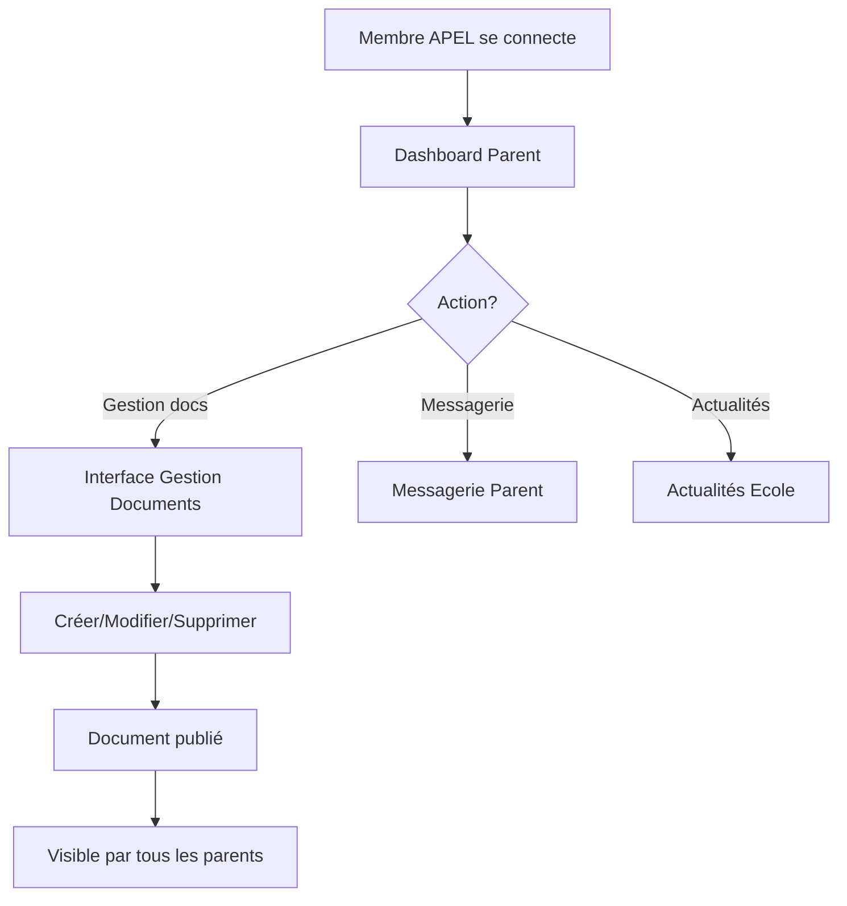

# 🤝 RÔLE APEL - Documentation Complète

## 📋 Présentation

Le rôle **APEL** (Association de Parents d'Élèves de l'Enseignement Libre) a été créé pour permettre aux membres de l'association de gérer leurs propres documents tout en conservant un accès parent au portail.

---

## 🎯 Permissions et Accès

### ✅ Accès Parent (Base)

Les membres APEL ont **tous les accès d'un parent** :

- 👨‍👩‍👧‍👦 Dashboard parent
- 📧 Messagerie parents
- 📰 Consultation des actualités
- 📄 Consultation de tous les documents (école, pastorale, APEL)
- 📅 Calendrier scolaire
- 👶 Suivi de leurs enfants (si applicable)

### 🆕 Accès Spécifiques APEL

En plus des accès parent, les membres APEL peuvent :

#### **Gestion des Documents**
- ✅ **Créer** des documents dans toutes les catégories
- ✅ **Modifier** des documents existants
- ✅ **Supprimer** des documents
- ✅ **Activer/Désactiver** la visibilité des documents
- ✅ **Upload** de fichiers PDF, DOC, DOCX, TXT (jusqu'à 10MB)
- ✅ **Ajouter** des liens externes

#### **Catégories de Documents Accessibles**
- 📚 **Documents École**
  - Règlement intérieur
  - Chartes
  - Documents officiels
  - Circulaires

- ⛪ **Documents Pastorale**
  - Projets pastoraux
  - Célébrations
  - Catéchèse
  - Informations religieuses

- 🤝 **Documents APEL** (priorité)
  - Comptes-rendus APEL
  - Projets APEL
  - Informations APEL
  - Événements APEL

---

## 🔧 Configuration Technique

### Middleware d'authentification

Le système utilise le middleware `requireDocumentManager` qui autorise :
```javascript
['DIRECTION', 'ADMIN', 'GESTIONNAIRE_SITE', 'SECRETAIRE_DIRECTION', 'APEL']
```

### Routes accessibles

```
GET  /documents/admin          - Interface de gestion
POST /documents/admin/create   - Créer un document
POST /documents/admin/:id      - Modifier un document  
POST /documents/admin/:id/delete - Supprimer un document
POST /documents/admin/:id/toggle - Activer/Désactiver
```

### Fichiers modifiés

1. **src/middleware/auth.js**
   - Nouveau middleware `requireDocumentManager`
   - Logs détaillés pour le débogage

2. **src/routes/documentRoutes.js**
   - Routes admin accessibles avec `requireDocumentManager`
   - Remplacement de `requireDirection` par `requireDocumentManager`

3. **src/views/partials/header.twig**
   - Menu spécifique APEL avec lien vers gestion documents

4. **src/views/pages/parent/dashboard.twig**
   - Carte "Gestion Documents" visible uniquement pour APEL

---

## 👥 Création des Comptes APEL

### Script de création

Un script `create-apel-users.js` permet de créer facilement des comptes APEL :

```bash
node create-apel-users.js
```

### Comptes créés par défaut

1. **Président APEL**
   - 📧 Email: `president.apel@ecole-saint-mathieu.fr`
   - 🔑 Mot de passe temporaire: `APEL2025!`

2. **Trésorier APEL**
   - 📧 Email: `tresorier.apel@ecole-saint-mathieu.fr`
   - 🔑 Mot de passe temporaire: `APEL2025!`

3. **Secrétaire APEL**
   - 📧 Email: `secretaire.apel@ecole-saint-mathieu.fr`
   - 🔑 Mot de passe temporaire: `APEL2025!`

### ⚠️ Important

- Les membres APEL **doivent changer leur mot de passe** à la première connexion
- Les comptes sont créés avec `emailVerified: true` et `active: true`
- Le rôle est automatiquement défini sur `APEL`

---

## 🚀 Déploiement

### Étapes pour activer les comptes APEL

1. **Créer les comptes**
   ```bash
   node create-apel-users.js
   ```

2. **Communiquer les identifiants**
   - Envoyer les emails et mots de passe temporaires aux membres APEL
   - Insister sur le changement de mot de passe obligatoire

3. **Formation**
   - Montrer l'accès à "Gestion Documents" dans le menu
   - Expliquer comment créer/modifier/supprimer des documents
   - Présenter les différentes catégories de documents

---

## 📱 Interface Utilisateur

### Dashboard Parent (avec badge APEL)

Lorsqu'un membre APEL se connecte, il voit :

```
┌─────────────────────────────────────┐
│  👨‍👩‍👧‍👦 Espace Parents             │
│  Bienvenue, Prénom Nom              │
│  🤝 Membre APEL                     │
└─────────────────────────────────────┘

⚡ Services Parents

┌──────────────┐  ┌──────────────┐
│  📄          │  │  📧          │
│  Gestion     │  │  Messagerie  │
│  Documents   │  │              │
│  🤝 APEL     │  │              │
└──────────────┘  └──────────────┘

┌──────────────┐
│  📰          │
│  Actualités  │
│              │
└──────────────┘
```

### Menu de Navigation

Dans le menu mobile et desktop, les membres APEL voient :
- 🏠 Accueil
- 📄 **Gestion Documents** (lien direct)
- 👤 Mon profil
- 🚪 Déconnexion

---

## 🔍 Cas d'Usage

### Exemple 1: Publier un compte-rendu de réunion

1. Se connecter avec un compte APEL
2. Cliquer sur "📄 Gestion Documents"
3. Cliquer sur "Ajouter un document"
4. Remplir le formulaire :
   - Type: `Comptes-rendus APEL`
   - Titre: "Réunion APEL - 15 octobre 2025"
   - Description: "Compte-rendu de la réunion mensuelle"
   - Uploader le fichier PDF
5. Cliquer sur "Créer"

### Exemple 2: Mettre à jour un projet APEL

1. Aller dans "Gestion Documents"
2. Trouver le document à modifier
3. Cliquer sur "Modifier"
4. Mettre à jour les informations
5. Uploader un nouveau fichier si nécessaire
6. Sauvegarder

### Exemple 3: Gérer la visibilité d'un document

1. Dans "Gestion Documents"
2. Trouver le document
3. Cliquer sur le bouton "👁️ Visible" / "👁️ Masqué"
4. Le document est instantanément activé/désactivé

---

## 🛡️ Sécurité

### Restrictions

Les membres APEL **NE PEUVENT PAS** :
- ❌ Accéder aux fonctionnalités de direction
- ❌ Gérer les inscriptions
- ❌ Créer ou modifier des actualités
- ❌ Accéder aux statistiques d'administration
- ❌ Gérer les utilisateurs
- ❌ Accéder au dashboard direction

### Protection

- ✅ Authentification obligatoire pour toutes les routes
- ✅ Vérification du rôle à chaque requête
- ✅ Logs détaillés des actions effectuées
- ✅ Sessions sécurisées

---

## 📊 Logs et Monitoring

### Logs générés

Toutes les actions des membres APEL sont loguées :

```
📄 Vérification GESTION DOCUMENTS - Session user: president.apel@ecole-saint-mathieu.fr
🎭 Rôle utilisateur: APEL
✅ Accès gestion documents autorisé

📝 === CRÉATION DE DOCUMENT ===
Utilisateur: president.apel@ecole-saint-mathieu.fr
Données reçues: { type: 'APEL_COMPTES_RENDUS', titre: 'Réunion octobre' }
✅ Document créé avec succès, ID: 42
```

---

## 🔄 Workflow Typique



---

## ❓ FAQ

### Q: Un membre APEL peut-il voir les documents d'autres auteurs ?
**R:** Oui, dans l'interface de gestion, ils voient tous les documents mais ne peuvent modifier que les leurs (fonctionnalité à implémenter si nécessaire).

### Q: Que se passe-t-il si un membre APEL n'a pas d'enfants inscrits ?
**R:** Le dashboard s'adapte et n'affiche pas la section "Mes Enfants". Seuls les services généraux sont accessibles.

### Q: Les membres APEL peuvent-ils créer des documents dans toutes les catégories ?
**R:** Oui, mais il est recommandé qu'ils se concentrent sur les catégories APEL.

### Q: Comment retirer le rôle APEL à quelqu'un ?
**R:** Via la gestion des utilisateurs en tant qu'admin, changer le rôle de `APEL` à `PARENT`.

---

## 📝 À Faire (Améliorations futures)

### Phase 2 - Permissions granulaires
- [ ] Permettre aux membres APEL de ne modifier que leurs propres documents
- [ ] Ajouter un système de validation par la direction
- [ ] Historique des modifications de documents

### Phase 3 - Fonctionnalités APEL spécifiques
- [ ] Gestion des événements APEL
- [ ] Système de votation en ligne
- [ ] Gestion des adhésions APEL
- [ ] Statistiques de participation

---

## 📅 Date de création

**13 octobre 2025**

## 📞 Support

Pour toute question concernant le rôle APEL :
- 📧 Contact technique
- 📚 Documentation complète dans `/docs`

---

## ✅ Checklist de déploiement

- [x] Middleware `requireDocumentManager` créé
- [x] Routes mises à jour avec le nouveau middleware
- [x] Interface utilisateur adaptée (dashboard + menu)
- [x] Script de création de comptes APEL
- [x] Documentation complète
- [ ] Formation des membres APEL
- [ ] Test en production
- [ ] Communication aux utilisateurs

---

**Note:** Ce rôle permet à l'APEL d'être autonome dans la gestion de leurs documents tout en conservant une expérience parent complète. 🤝✨
